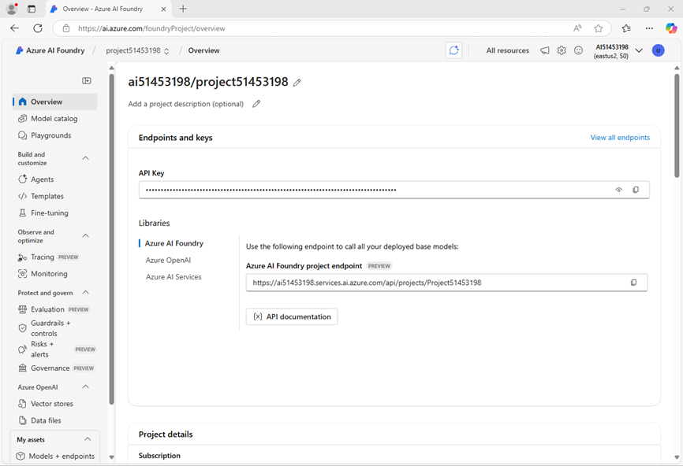

---
lab:
  title: AI エージェントをリモート MCP サーバーに接続する
  description: モデル コンテキスト プロトコル ツールと AI エージェントを統合する方法について学習する
---

# モデル コンテキスト プロトコル (MCP) を使用して AI エージェントをツールに接続する

この演習では、クラウドでホストされている MCP サーバーに接続するエージェントを構築します。 エージェントは、AI を利用した検索を使用して、開発者が Microsoft の公式ドキュメントからリアルタイムに正確な回答を見つけるのを支援します。 これは、Azure、.NET、Microsoft 365 などのツールに関する最新のガイダンスを使用して開発者をサポートするアシスタントを構築する場合に役立ちます。 エージェントは、提供された `microsoft_docs_search` ツールを使用してドキュメントのクエリを実行し、関連する結果を返します。

> **ヒント**: この演習で使用したコードは、Azure AI エージェント サービス MCP サポート サンプル リポジトリに基づいています。 [Azure OpenAI のデモ](https://github.com/retkowsky/Azure-OpenAI-demos/blob/main/Azure%20Agent%20Service/9%20Azure%20AI%20Agent%20service%20-%20MCP%20support.ipynb)を参照するか、「[モデル コンテキスト プロトコル サーバーへの接続](https://learn.microsoft.com/en-us/azure/ai-foundry/agents/how-to/tools/model-context-protocol)」にアクセスして詳細を確認してください。

この演習の所要時間は約 **30** 分です。

> **注**: この演習で使用されるテクノロジの一部は、プレビューの段階または開発中の段階です。 予期しない動作、警告、またはエラーが発生する場合があります。

## Azure AI Foundry プロジェクトを作成する

まず、Azure AI Foundry プロジェクトを作成します。

1. Web ブラウザーで [Azure AI Foundry ポータル](https://ai.azure.com) (`https://ai.azure.com`) を開き、Azure 資格情報を使用してサインインします。 初めてサインインするときに開いたヒントまたはクイック スタート ウィンドウを閉じます。また、必要に応じて左上にある **Azure AI Foundry** ロゴを使用してホーム ページに移動します。それは次の画像のようになります (**[ヘルプ]** ウィンドウが開いている場合は閉じます)。

    

1. ホーム ページで、**[エージェントを作成する]** を選択します。
1. プロジェクトの作成を求められたら、プロジェクトの有効な名前を入力し、**[詳細]** オプションを展開します。
1. プロジェクトについて次の設定を確認します。
    - **Azure AI Foundry リソース**: *Azure AI Foundry リソースの有効な名前*
    - **[サブスクリプション]**:"*ご自身の Azure サブスクリプション*"
    - **リソース グループ**: *リソース グループを作成または選択します*
    - **リージョン**: ***AI サービスでサポートされている場所を選択します***\*

    > \* 一部の Azure AI リソースは、リージョンのモデル クォータによって制限されます。 演習の後半でクォータ制限を超えた場合は、別のリージョンに別のリソースを作成する必要が生じる可能性があります。

1. **[作成]** を選択して、プロジェクトが作成されるまで待ちます。
1. メッセージが表示されたら、(クォータの可用性に応じて) *[Global Standard]* または *[Standard]* デプロイ オプションを使用して、**gpt-4o** モデルをデプロイします。

    >**注**:クォータが使用可能な場合は、エージェントとプロジェクトの作成時に GPT-4o 基本モデルが自動的にデプロイされることがあります。

1. プロジェクトが作成されると、エージェント プレイグラウンドが開きます。

1. 左側のナビゲーション ウィンドウで **[概要]** を選択すると、プロジェクトのメイン ページが表示されます。次のようになります。

    

1. **Azure AI Foundry プロジェクト エンドポイント**の値をメモ帳にコピーします。後でこれを使用して、クライアント アプリケーション内でプロジェクトに接続します。

## MCP 関数ツールを使用するエージェントを開発する

AI Foundry でプロジェクトを作成したので、AI エージェントと MCP サーバーを統合するアプリを開発しましょう。

### アプリケーション コードを含むリポジトリを複製する

1. 新しいブラウザー タブを開きます (既存のタブで Azure AI Foundry ポータルを開いたままにします)。 新しいブラウザー タブで [Azure portal](https://portal.azure.com) (`https://portal.azure.com`) を開き、メッセージに応じて Azure 資格情報を使用してサインインします。

    ウェルカム通知を閉じて、Azure portal のホーム ページを表示します。

1. ページ上部の検索バーの右側にある **[\>_]** ボタンを使用して、Azure portal に新しい Cloud Shell を作成し、サブスクリプションにストレージがない ***PowerShell*** 環境を選択します。

    Azure portal の下部にあるペインに Cloud Shell のコマンド ライン インターフェイスが表示されます。 作業しやすくするために、このウィンドウのサイズを変更したり最大化したりすることができます。

    > **注**: *Bash* 環境を使用するクラウド シェルを以前に作成した場合は、それを ***PowerShell*** に切り替えます。

1. Cloud Shell ツール バーの **[設定]** メニューで、**[クラシック バージョンに移動]** を選択します (これはコード エディターを使用するのに必要です)。

    **<font color="red">続行する前に、クラシック バージョンの Cloud Shell に切り替えたことを確認します。</font>**

1. Cloud Shell 画面で、次のコマンドを入力して、この演習のコード ファイルを含む GitHub リポジトリをクローンします (コマンドを入力するか、クリップボードにコピーしてから、コマンド ラインで右クリックし、プレーンテキストとして貼り付けます)。

    ```
   rm -r ai-agents -f
   git clone https://github.com/MicrosoftLearning/mslearn-ai-agents ai-agents
    ```

    > **ヒント**: Cloudshell にコマンドを入力すると、出力が大量のスクリーン バッファーを占有し、現在のライン上のカーソルが隠れてしまう可能性があります。 `cls` コマンドを入力して、各タスクに集中しやすくすることで、スクリーンをクリアできます。

1. 次のコマンドを入力して、作業ディレクトリをコード ファイルを含むフォルダーに変更し、すべてを一覧表示します。

    ```
   cd ai-agents/Labfiles/07-use-agent-tools-with-mcp/Python
   ls -a -l
    ```

### アプリケーション設定を構成する

1. Cloud Shell コマンド ライン ペインで、次のコマンドを入力して、使用するライブラリをインストールします。

    ```
   python -m venv labenv
   ./labenv/bin/Activate.ps1
   pip install -r requirements.txt azure-ai-projects mcp
    ```

    >**注:** ライブラリのインストール中に表示される警告やエラー メッセージは無視しても構いません。

1. 次のコマンドを入力して、提供されている構成ファイルを編集します。

    ```
   code .env
    ```

    このファイルをコード エディターで開きます。

1. コード ファイルで、**your_project_endpoint** プレースホルダーをプロジェクトのエンドポイント (Azure AI Foundry ポータルのプロジェクトの **[概要]** ページからコピーしたもの) に置き換え、MODEL_DEPLOYMENT_NAME 変数がモデル デプロイ名 (*gpt-4o*) に設定されていることを確認します。

1. プレースホルダーを置き換えたら、**Ctrl + S** コマンドを使用して変更を保存してから、**Ctrl + Q** コマンドを使用して、Cloud Shell コマンド ラインを開いたままコード エディターを閉じます。

### Azure AI エージェントをリモート MCP サーバーに接続する

このタスクでは、リモート MCP サーバーに接続し、AI エージェントを準備し、ユーザー プロンプトを実行します。

1. コメント **Add references** を見つけて、クラスをインポートする次のコードを追加します。

    ```python
   # Add references
   from azure.identity import DefaultAzureCredential
   from azure.ai.agents import AgentsClient
   from azure.ai.agents.models import McpTool
    ```

1. コメント **Connect to the agents client** を見つけて、現在の Azure 資格情報を使用して Azure AI プロジェクトに接続する次のコードを追加します。

    ```python
   # Connect to the agents client
   agents_client = AgentsClient(
        endpoint=project_endpoint,
        credential=DefaultAzureCredential(
            exclude_environment_credential=True,
            exclude_managed_identity_credential=True
        )
   )
    ```

1. コメント **Initialize agent MCP tool** の下に、次のコードを追加します。

    ```python
   # Initialize agent MCP tool
   mcp_tool = McpTool(
       server_label=mcp_server_label,
       server_url=mcp_server_url,
   )
    ```

    このコードは、Microsft Learn Docs リモート MCP サーバーに接続します。 これは、クライアントが Microsoft の公式ドキュメントから直接信頼できる最新の情報にアクセスできるようにする、クラウドでホストされたサービスです。

1. コメント **Create a new agent with the mcp tool definitions** の下に、次のコードを追加します。

    ```python
   # Create a new agent with the mcp tool definitions
   agent = agents_client.create_agent(
       model=model_deployment,
       name="my-mcp-agent",
       instructions="""
        You have access to an MCP server called `microsoft.docs.mcp` - this tool allows you to 
        search through Microsoft's latest official documentation. Use the available MCP tools 
        to answer questions and perform tasks.""",
       tools=mcp_tool.definitions,
   )
    ```

    このコードで、エージェントに指示を与え、MCO ツール定義を提供します。

1. コメント **Create thread for communication** を見つけて、次のコードを追加します。

    ```python
   # Create thread for communication
   thread = agents_client.threads.create()
   print(f"Created thread, ID: {thread.id}")
    ```

1. コメント **Create a message on the thread** を見つけて、次のコードを追加します。

    ```python
   # Create a message on the thread
   message = agents_client.messages.create(
       thread_id=thread.id,
       role="user",
       content="Give me the Azure CLI commands to create an Azure Container App with a managed identity.",
   )
   print(f"Created message, ID: {message.id}")
    ```

1. コメント **Update mcp tool headers** の下に、次のコードを追加します。

    ```python
   # Update mcp tool headers
   mcp_tool.update_headers("SuperSecret", "123456")
    ```

1. コメント **Set approval mode** を見つけて、次のコードを追加します。

    ```python
   # Set approval mode
   mcp_tool.set_approval_mode("never")
    ```

1. コメント **Create and process agent run in thread with MCP tools** を見つけて、次のコードを追加します。

    ```python
   # Create and process agent run in thread with MCP tools
   run = agents_client.runs.create_and_process(thread_id=thread.id, agent_id=agent.id, tool_resources=mcp_tool.resources)
   print(f"Created run, ID: {run.id}")
    ```
    
    AI エージェントが、接続された MCP ツールを自動的に起動し、プロンプトの要求を処理します。 このプロセスを説明するために、コメント **Display run steps and tool calls** の下に指定されたコードが、MCP サーバーから呼び出されたツールを出力します。

1. 完了したら、コード ファイルを保存します (*CTRL + S*)。 コード エディターを閉じても構いません (*CTRL + Q*) が、追加したコードを編集する必要がある場合に備えて開いたままにしておくこともできます。 どちらの場合も、Cloud Shell のコマンド ライン ペインは開いたままにします。

### Azure にサインインしてアプリを実行する

1. Cloud Shell コマンド ライン ペインで、次のコマンドを入力して Azure にサインインします。

    ```
   az login
    ```

    **<font color="red">Cloud Shell セッションが既に認証されている場合でも、Azure にサインインする必要があります。</font>**

    > **注**: ほとんどのシナリオでは、*az ログイン*を使用するだけで十分です。 ただし、複数のテナントにサブスクリプションがある場合は、*[--tenant]* パラメーターを使用してテナントを指定する必要があります。 詳細については、「[Azure CLI を使用して対話形式で Azure にサインインする](https://learn.microsoft.com/cli/azure/authenticate-azure-cli-interactively)」を参照してください。
    
1. メッセージが表示されたら、指示に従って新しいタブでサインイン ページを開き、指定された認証コードと Azure 資格情報を入力します。 次に、コマンド ラインでサインイン プロセスを完了し、プロンプトが表示されたら、Azure AI Foundry ハブを含むサブスクリプションを選択します。

1. サインインしたら、次のコマンドを入力してアプリケーションを実行します。

    ```
   python client.py
    ```

    次のような出力が表示されます。

    ```
    Created agent, ID: <<agent-id>>
    MCP Server: mslearn at https://learn.microsoft.com/api/mcp
    Created thread, ID: <<thread-id>>
    Created message, ID: <<message-id>>
    Created run, ID: <<run-id>>
    Run completed with status: RunStatus.COMPLETED
    Step <<step1-id>> status: completed

    Step <<step2-id>> status: completed
    MCP Tool calls:
        Tool Call ID: <<tool-call-id>>
        Type: mcp
        Type: microsoft_docs_search


    Conversation:
    --------------------------------------------------
    ASSISTANT: You can use Azure CLI to create an Azure Container App with a managed identity (either system-assigned or user-assigned). Below are the relevant commands and workflow:

    ---

    ### **1. Create a Resource Group**
    ```azurecli
    az group create --name myResourceGroup --location eastus
    ```

    {{続き...}}

    これらの手順に従うことで、システム割り当てマネージド ID またはユーザー割り当てマネージド ID を使用して Azure Container App をデプロイし、他の Azure サービスとシームレスに連携できます。
    --------------------------------------------------
    USER:マネージド ID を使って Azure Container App を作成する Azure CLI コマンドを教えてください。
    --------------------------------------------------
    削除済みのエージェント
    ```

    Notice that the agent was able to invoke the MCP tool `microsoft_docs_search` automatically to fulfill the request.

## Clean up

Now that you've finished the exercise, you should delete the cloud resources you've created to avoid unnecessary resource usage.

1. Open the [Azure portal](https://portal.azure.com) at `https://portal.azure.com` and view the contents of the resource group where you deployed the hub resources used in this exercise.
1. On the toolbar, select **Delete resource group**.
1. Enter the resource group name and confirm that you want to delete it.
