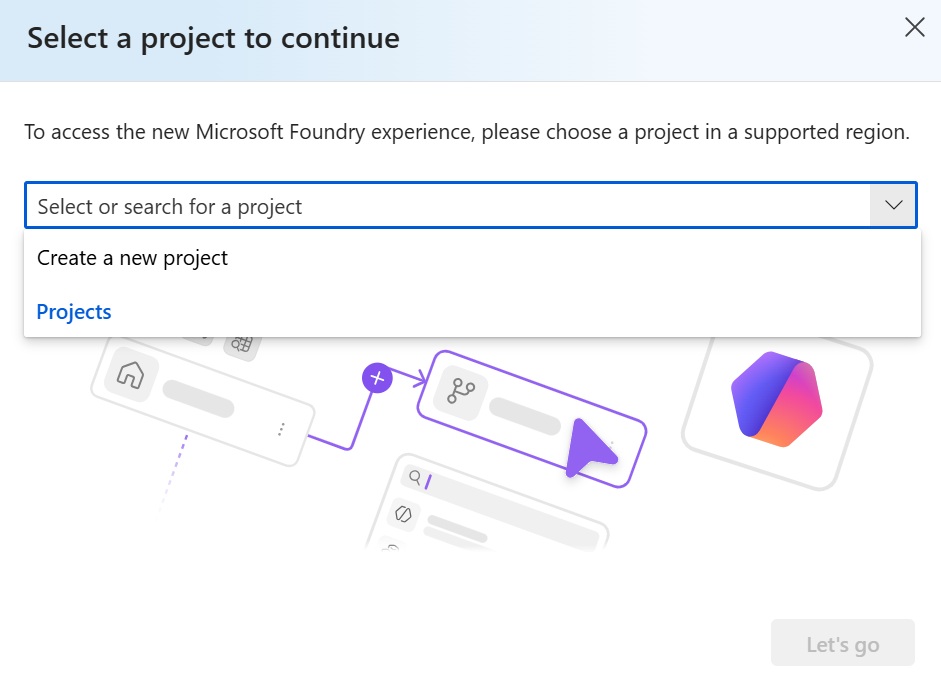

---
lab:
  title: Microsoft Foundry でワークフローを構築する
  description: Microsoft Foundry ポータルを使用して、AI エージェント用のワークフローを作成します。
  level: 300
  duration: 45
  islab: true
---

# Microsoft Foundry でワークフローを構築する

この演習では、Microsoft Foundry ポータルを使用してワークフローを作成します。 ワークフローは、AI エージェントに関連する一連のアクションを定義するのに使用できる UI ベースのツールです。 この演習では、カスタマー サポート要求の解決に役立つワークフローを作成します。

**ワークフローの概要**

- 受信したサポート チケットを収集する

    このワークフローは、事前に定義されたカスタマー サポートの問題の配列から始まります。 配列内の各項目は、ContosoPay に送信された個々のサポート チケットを表します。

- チケットを一度に 1 つずつ処理する

    for-each ループは配列を反復処理し、各サポート チケットが同じワークフロー ロジックを使用しながら個別に処理されるようにします。

- AI エージェントを使用して各チケットを分類する

    ワークフローでは、チケットごとにトリアージ エージェントを呼び出して、問題を課金、技術、または一般として分類し、信頼度を設定します。

- 条件付きロジックを使用して不確実性を処理する

    信頼度スコアが定義されたしきい値を下回る場合、ワークフローはそのチケットに関する追加情報を推奨します。

- 問題のカテゴリに基づいてルーティングする

    課金の問題にはエスカレーションのフラグが設定され、自動解決パスから削除されます。
    技術的および一般的な問題については、自動処理が続行されます。

- 推奨される応答を生成する

    課金以外のチケットの場合、ワークフローは解決エージェントを呼び出して、カテゴリに適したサポート応答の下書きを作成します。

この演習の所要時間は約 **30** 分です。

> **注**:Microsoft Foundry のワークフロー ビルダーは現在プレビュー段階です。 予期しない動作、警告、またはエラーが発生する場合があります。 進行を妨げる問題が発生した場合は、新しいプロジェクトとワークフローで最初からやり直さなければならないことがあります。

## 前提条件

この演習を開始するには、以下のものが必要です。

- ローカル コンピューターに [Visual Studio Code](https://code.visualstudio.com/) がインストールされている
- 有効な [Azure サブスクリプション](https://azure.microsoft.com/free/)
- [Python 3.13](https://www.python.org/downloads/) 以降がインストールされている
- ローカル コンピューターに [Git](https://git-scm.com/downloads) がインストールされている

> \* Python 3.13 を使用できますが、一部の依存関係がそのリリース用にまだコンパイルされていません。 このラボでは Python 3.13.12 でテストが正常に終了しました。

## Foundry プロジェクトを作成する

まず、Foundry プロジェクトを作成しましょう。

1. Web ブラウザーで、[Foundry ポータル](https://ai.azure.com) (`https://ai.azure.com`) を開き、Azure 資格情報を使用してサインインします。

1. **[新しい Foundry]** トグルが *[オン]* に設定されていることを確認します。

    ![[新しい Foundry] トグルのスクリーンショット。](../Media/ai-foundry-toggle.png)

2. 新しい Foundry エクスペリエンスに進む前に、新しいプロジェクトを作成するように求められる場合があります。 **[新しいプロジェクトの作成]** を選択します。

    

    メッセージが表示されない場合は、左上の [プロジェクト] ドロップダウン メニューを選択してから、**[新しいプロジェクトの作成]** を選択します。

3. テキスト ボックスに Foundry プロジェクトの名前を入力し、**[作成]** を選択します。

    プロジェクトが作成されるまでしばらく待ちます。 プロジェクトが選択された状態で、新しい Foundry ポータルのホーム ページが表示されます。

4. **[新しい Microsoft Foundry へようこそ]** ダイアログが表示された場合は、閉じてください。

    ダイアログで、現時点では不要なエージェントを作成するように求められる場合があります。 エージェントは後の手順で作成します。

## カスタマー サポートのトリアージ ワークフローを作成する

このセクションでは、ContosoPay という架空の会社のカスタマー サポート要求をトリアージして応答するのに役立つワークフローを作成します。 このワークフローでは、サポート チケットを分類して応答する 2 つの AI エージェントを使用します。

1. Foundry ポータルのホーム ページで、ツール バー メニューから **[ビルド]** を選択します。

1. 左側のメニューで **[エージェント]** を選択し、**[ワークフロー]** タブを選択します。

1. 右上隅にある **[作成]** > **[空のワークフロー]** を選択して、新しい空のワークフローを作成します。

    この演習で作成するワークフローの種類は、シーケンシャル ワークフローです。 ただし、空のワークフローから開始すると、必要なノードを追加するプロセスが簡略化されます。

1. ビジュアライザーで **[保存]** を選択して、新しいワークフローを保存します。 ダイアログ ボックスで、ワークフローの名前 (*ContosoPay-Customer-Support-Triage* など) を入力し、**[保存]** を選択します。

## チケットの配列の変数を作成する

1. ワークフロー ビジュアライザーで、**[+]** (プラス) アイコンを選択して、新しいノードを追加します。

1. ワークフローのアクション メニューの **[データ変換]** で、**[変数の設定]** を選択して、サポート チケットの配列を初期化するノードを追加します。

2. **[変数の設定]** ノード エディターで、*SupportTickets* のように新しい変数の名前を入力します。

    ![[変数の設定] ノードで新しい変数を作成しているスクリーンショット。](../Media/node-new-variable.png)

    新しい変数が `Local.SupportTickets` として表示されます。

3. **[対象値]** フィールドに、サンプルのサポート チケットを含む次の配列を入力します。

    ```output
   [ 
    "The API returns a 403 error when creating invoices, but our API key hasn't changed.", 
    "Is there a way to export all invoices as a CSV?", 
    "I was charged twice for the same invoice last Friday and my customer is also seeing two receipts. Can someone fix this?"]
    ```

4. **[完了]** を選択して、ノードを保存します。

## チケットを処理するための for-each ループを追加する

1. **[変数の設定]** の下にある **[+]** (プラス) アイコンを選択し、配列内の各サポート チケットを処理する **[For each]** ノードを作成します。

1. **[For each]** ノード エディターで、**[For each ループする項目を選択する]** フィールドを、先ほど作成した変数 (`Local.SupportTickets`) に設定します。

1. **[ループ値変数]** フィールドで、`CurrentTicket` という名前の新しい変数を作成します。

1. **[完了]** を選択して、ノードを保存します。

## エージェントを呼び出してチケットを分類する

1. **For each**ノード内の **[+]** (プラス) アイコンを選択して、現在のサポート チケットを分類する新しいノードを追加します。

2. ワークフローのアクション メニューの **[呼び出し]** で、**[エージェント]** を選択して、エージェント ノードを追加します。

3. **[エージェント]** ノード エディターの **[エージェントの選択]** で、**[新しいエージェントの作成]** を選択します。

4. *Triage-Agent* などのエージェント名を入力し、**[作成]** を選択します。

### エージェント設定を構成する

1. エディターの **[詳細]** で、モデル名の近くにある **[パラメーター]** ボタンを選択します。

    ![エージェント エディターの [パラメーター] ボタンのスクリーンショット。](../Media/agent-parameters.png)

2. **[パラメーター]** ペインで、**[テキスト形式]** の横にある **[JSON スキーマ]** を選択します。

3. **[応答形式の追加]** ペインで、次の定義を入力し、**[保存]** を選択します。

    ```json
    {
    "name": "category_response",
    "schema": {
        "type": "object",
        "properties": {
            "customer_issue": {
                "type": "string"
            },
            "category": {
                "type": "string"
            },
            "confidence": {
                "type": "number"
            }
        },
        "additionalProperties": false,
        "required": [
            "customer_issue",
            "category",
            "confidence"
        ]
    },
    "strict": true
    }
    ```

4. [エージェントの詳細] ペインで、**[指示]** フィールドを次のプロンプトに設定します。

    ```output
    Classify the user's problem description into exactly ONE category from the list below. Provide a confidence score from 0 to 1.

    Billing
    - Charges, refunds, duplicate payments
    - Missing or incorrect payouts
    - Subscription pricing or invoices being charged

    Technical
    - API errors, integrations, webhooks
    - Platform bugs or unexpected behavior

    General
    - How-to questions
    - Feature availability
    - Data exports, reports, or UI navigation

    Important rules
    - Questions about exporting, viewing, or downloading invoices are General, not Billing
    - Billing ONLY applies when money was charged, refunded, or paid incorrectly
    ```

5. **[ノードの設定]** を選択して、エージェントの入力と出力を構成します。

6. **[入力メッセージ]** フィールドを `Local.CurrentTicket` 変数に設定します。

7. **[名前を付けてエージェントの出力メッセージを保存]** で、`TriageOutputText` という名前の新しい変数を作成します。

8. **[名前を付けて出力 json_object を保存]** で、`TriageOutputJson` という名前の新しい変数を作成します。

9. **[完了]** を選択して、ノードを保存します。

## 信頼度の低い分類を処理する

1. **[エージェントの呼び出し]** ノードの下にある **[+]** (プラス) アイコンを選択して、信頼度の低い分類を処理する新しいノードを追加します。

1. ワークフローのアクション メニューの **[フロー]** で、**[If/Else]** を選択して、条件付きロジック ノードを追加します。

1. **[If/Else]** ノード エディターで、**[パスの追加]** ボタンを選択して if 分岐条件を作成してから、鉛筆アイコンを選択して条件を編集します。

1. **[条件]** フィールドを次の式に設定して、信頼度スコアが 0.6 を上回るかどうかを確認します。

    ```output
   Local.TriageOutputJson.confidence > 0.6
    ```

1. **[完了]** を選択して、ノードを保存します。

## 信頼度の低いチケットの追加情報を推奨する

1. ビジュアライザーで、**[If/Else 条件]** ノードの **[Else]** 分岐の下にある **[+]** (プラス) アイコンを選択して、信頼度の低いチケットの追加情報を推奨する新しいノードを追加します。

1. ワークフローのアクション メニューの **[基本]** で、**[メッセージの送信]** を選択して、メッセージの送信アクティビティを追加します。

1. **[メッセージの送信]** ノード エディターで、**[送信するメッセージ]** フィールドを次の応答に設定します。

    ```output
   The support ticket classification has low confidence. Requesting more details about the issue: "{Local.CurrentTicket}"
    ```

1. **[完了]** を選択して、ノードを保存します。

## カテゴリに基づいてチケットをルーティングする

このセクションでは、信頼度スコアが十分に高い場合に、分類されたカテゴリに基づいてチケットをルーティングする条件付きロジックを追加します。

1. ビジュアライザーで、**[If/Else 条件]** ノードの **[If]** 分岐の下にある **[+]** (プラス) アイコンを選択して、カテゴリに基づいてチケットをルーティングする新しいノードを追加します。

1. ワークフローのアクション メニューの **[フロー]** で、**[If/Else]** を選択して、別の条件付きロジック ノードを追加します。

1. **[If/Else]** ノード エディターで、**[パスの追加]** ボタンを選択して if 分岐条件を作成してから、鉛筆アイコンを選択して条件を編集します。

1. **[If 条件]** を次の式に設定して、チケット カテゴリが "課金" かどうかを確認します。

    ```output
    Local.TriageOutputJson.category = "Billing"
    ```

1. **[If/Else]** ノードの **[If]** 分岐の下にある **[+]** (プラス) アイコンを選択して、課金以外のチケットに対する応答の下書きを行う新しいノードを追加します。

1. ワークフローのアクション メニューの **[基本]** で、**[メッセージの送信]** を選択して、メッセージの送信アクティビティを追加します。

1. **[メッセージの送信]** ノード エディターで、**[送信するメッセージ]** を次の応答に設定します。

    ```output
   Escalate billing issue to human support team.
    ```

1. **[完了]** を選択して、ノードを保存します。

## 推奨される応答を生成する

1. ビジュアライザーで、2 番目の **[If/Else]** ノードの **[Else]** 分岐の下にある **[+]** (プラス) アイコンを選択して、課金以外のチケットに対する応答を下書きする新しいノードを追加します。

2. ワークフローのアクション メニューの **[呼び出し]** で、**[エージェント]** を選択して、エージェント ノードを追加します。

3. **[エージェント]** ノード エディターで、**[新しいエージェントの作成]** を選択します。

4. *Resolution-Agent * などのエージェント名を入力し、**[作成]** を選択します。

5. エージェント エディターで、**[指示]** フィールドを次のプロンプトに設定します。

    ```output
    You are a customer support resolution assistant for ContosoPay, a B2B payments and invoicing platform.

    Your task is to draft a clear, professional, and friendly support response based on the issue category and customer message.

    Guidelines:
    If the issue category is Technical:
    Suggest 1–2 common troubleshooting steps at a high level.

    Avoid asking for logs, credentials, or sensitive data.

    Do not imply fault by the customer.
    If the issue category is General:
    Provide a concise, helpful explanation or guidance.
    Keep the response under 5 sentences.

    Tone:
    Professional, calm, and supportive
    Clear and concise
    No emojis

    Output:
    Return only the drafted response text.
    Do not include internal reasoning or analysis.
    ```

6. **[ノードの設定]** を選択して、エージェントの入力と出力を構成します。

7. **[入力メッセージ]** フィールドを `Local.TriageOutputText` 変数に設定します。

8. **[名前を付けてエージェントの出力メッセージを保存]** で、`ResolutionOutputText` という名前の新しい変数を作成します。

9. **[完了]** を選択して、ノードを保存します。

## ワークフローをプレビューする

1. **[保存]** ボタンを選択して、ワークフローに対するすべての変更を保存します。

1. **[プレビュー]** ボタンを選択してワークフローを開始します。

1. 表示されるチャット ウィンドウで、何らかのテキスト (例: `Start processing support tickets.`) を入力して、ワークフローをトリガーします

1. ワークフローで各サポート チケットが順番に処理されるのを確認します。 チャット ウィンドウで、ワークフローによって生成されたメッセージを確認します。

    課金の問題については、エスカレートされていることを示す出力がいくつか表示され、技術的な問題と一般的な問題については、下書きされた応答が返されます。 次に例を示します。

    ```output
    Current Ticket:
    The API returns a 403 error when creating invoices, but our API key hasn't changed.


    Copilot said:
    Thank you for reaching out about the 403 error when creating invoices. This error typically indicates a permissions or access issue. 
    Please ensure that your API key has the necessary permissions for invoice creation and that your request is being sent to the correct endpoint. 
    If the issue persists, try regenerating your API key and updating it in your integration to see if that resolves the problem.
    ```

## クライアント アプリケーションでワークフローを使用する

Foundry ポータルでワークフローをビルドしてテストしたら、それを Azure AI Projects SDK を使用して自分のコードから呼び出すこともできます。 これにより、ワークフローをアプリケーションに統合したり、その実行を自動化したりできます。

### スタート コード リポジトリをクローンする

この演習では、Foundry プロジェクトに接続してワークフローを呼び出すのに役立つスタート コードを使用します。

1. VS Code で、コマンド パレット (**Ctrl + Shift + P** または **[表示] > [コマンド パレット]**) を開きます。

1. 「**Git:Clone**」と入力してこれを一覧から選択します。

1. リポジトリの URL を入力します。

    ```
    https://github.com/MicrosoftLearning/mslearn-ai-agents.git
    ```

1. リポジトリをクローンするローカル コンピューター上の場所を選択します。

1. プロンプトが表示されたら **[開く]** を選択して、VS Code でクローンされたリポジトリを開きます。

1. リポジトリが開いたら、**[ファイル] > [フォルダーを開く]** を選択し、`mslearn-ai-agents/Labfiles/08-build-workflow-ms-foundry` に移動して、**[フォルダーの選択]** を選択します。

1. [エクスプローラー] ペインで、**[Python]** フォルダーを展開して、この演習のコード ファイルを表示します。 

### アプリケーションの構成

1. ブラウザーで、Foundry ポータルのワークフロー ビジュアライザーに戻ります。

2. ビジュアライザーの右上隅にある **[コード]** を選択します。 次に、**[.env 変数]** を選択して、コードから Foundry プロジェクトに接続するために必要な環境変数を表示します。

3. Foundry プロジェクトのエンドポイント URL である **AZURE_EXISTING_AIPROJECT_ENDPOINT** 変数の値をコピーします。 この値は、VS Code でプロジェクトに接続するときに必要になります。 

4. VS Code で、**[requirements.txt]** ファイルを右クリックし、**[統合ターミナルで開く]** を選択します。

5. ターミナルで、次のコマンドを入力して、仮想環境に必要な Python パッケージをインストールします。

    ```
    python -m venv labenv
    .\labenv\Scripts\Activate.ps1
    pip install -r requirements.txt
    ```

6. **.env** ファイルを開き、**[your_project_endpoint]** プレースホルダーをプロジェクトのエンドポイント (ワークフロー ビジュアライザーの [コード] タブからコピーしたもの) に置き換えます。 これらの変更を行った後、**Ctrl + S** を使用してファイルを保存します。

### コードからワークフローを呼び出す

これで、ワークフローを呼び出すプロジェクトを作成する準備ができました。 それでは始めましょう。

1. コード エディターで **workflow.py** ファイルを開きます。

1. 各エージェント名と指示の文字列が含まれていることに注意して、ファイル内のコードを確認します。

1. 「**Add references (参照を追加する)**」というコメントを見つけて以下のコードを追加し、必要なクラスをインポートします。

    ```python
   # Add references
   from azure.identity import DefaultAzureCredential
   from azure.ai.projects import AIProjectClient
    ```

2. コメント **Connect to the agents client (エージェント クライアントに接続する)** を見つけて次のコードを追加し、プロジェクトに接続された AgentsClient を作成します。

    ```python
   # Connect to the AI Project client
   with (
       DefaultAzureCredential() as credential,
       AIProjectClient(endpoint=endpoint, credential=credential) as project_client,
       project_client.get_openai_client() as openai_client,
   ):
    ```

    次に、AgentsClient を使用して複数のエージェントを作成するコードを追加します。各エージェントには、サポート チケットの処理で果たす特定の役割があります。

    > **ヒント**: 後続のコードを追加するときは、適切なレベルのインデントを維持してください。

3. コメント **Specify the workflow (ワークフローを指定する)** を見つけ、次のコードを追加します。

    ```python
   # Specify the workflow
    workflow = {
        "name": "ContosoPay-Customer-Support-Triage"
    }
    ```

    Foundry ポータルで作成したワークフローの名前とバージョンを必ず使用してください。

4. コメント **Create a conversation and run the workflow** を見つけ、次のコードを追加して会話を作成し、ワークフローを呼び出します。

    ```python
    # Create a conversation and run the workflow
    conversation = openai_client.conversations.create()
    print(f"Created conversation (id: {conversation.id})")

    stream = openai_client.responses.create(
        conversation=conversation.id,
        extra_body={"agent_reference" : {"name" : workflow["name"], "type": "agent_reference"}},
        input="Start",
        stream=True,
    )
    ```

    このコードは、ワークフロー実行の出力をコンソールにストリーミングして、ワークフローが各チケットを処理するときにメッセージのフローを確認できるようにします。

5. コメント **Process events from the workflow run** を見つけ、次のコードを追加してストリーミングされた出力を処理し、メッセージをコンソールに出力します。

    ```python
    # Process events from the workflow run
   for event in stream:
        if (event.type == "response.completed"):
            print("\nResponse completed:")
            response = openai_client.responses.retrieve(event.response.id)
            print(f"{response.output_text}")
    ```

6. コメント **Clean up resources (リソースをクリーンアップする)** を見つけ、次のコードを入力して不要になった会話を削除します。

    ```python
   # Clean up resources
   openai_client.conversations.delete(conversation_id=conversation.id)
   print("\nConversation deleted")
    ```

7. **CTRL + S** コマンドを使用して、変更をコード ファイルに保存します。

## クライアント アプリケーションをテストする

これで、コードを実行し、AI エージェント間の共同作業を確認する準備ができました。

1. 統合ターミナルで、次のコマンドを実行します。
    ```
    az login
    ```

    ```
   python workflow.py
    ```

1. ワークフローがチケットを処理するまで少し待ちます。 ワークフローが実行されると、エージェントによって生成されたメッセージやワークフロー内の各アクションの状態の更新など、ワークフローの進行状況を示す出力がコンソールに表示されます。

1. ワークフローが完了すると、次のような出力が表示されるはずです。

    ```output
    Response completed:
    Current Ticket:
    The API returns a 403 error when creating invoices, but our API key hasn't changed.{"customer_issue":"API returns a 403 error when creating invoices, API key unchanged.","category":"Technical","confidence":1}Thank you for contacting us about the 403 error when creating invoices with the API. This error typically relates to permission issues. Please ensure your API key has the necessary permissions for invoice creation and that the endpoint URL is correct. If the issue persists, try regenerating the API key and updating it in your application.
    ...
    ```

    出力では、各チケットの分類や推奨される応答またはエスカレーションを含めて、ワークフローが各サポート チケットをどのように完了するかを確認できます。 上出来

2. 完了したら、ターミナルに「`deactivate`」と入力して、Python 仮想環境を終了します。

## クリーンアップ

Microsoft Foundry でのワークフローを調べ終わったら、不要な Azure コストが発生しないように、この演習で作成したリソースを削除する必要があります。

1. [Azure portal](https://portal.azure.com) (`https://portal.azure.com`) に移動し、Foundry プロジェクトをデプロイしたリソース グループの内容を表示します。

1. ツール バーの **[リソース グループの削除]** を選びます。
1. リソース グループ名を入力し、削除することを確認します。
