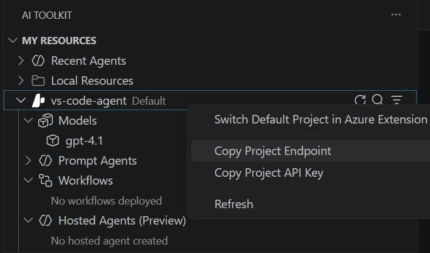

---
lab:
  title: Microsoft Agent Framework を使用してマルチエージェント ソリューションを開発する
  description: Microsoft Agent Framework SDK を使用して共同作業するための複数のエージェントを構成する方法について学習します
  level: 300
  duration: 30
  islab: true
---

# マルチエージェント ソリューションの開発

この演習では、Microsoft Agent Framework SDK での順次オーケストレーション パターンの使用について練習します。 連携して顧客からのフィードバックを処理し、次の手順を提案する 3 つのエージェントのシンプルなパイプラインを作成します。 次のエージェントを作成します。

- サマライザー エージェントは、生のフィードバックを短い中立的な文に要約します。
- 分類子エージェントは、フィードバックを肯定的、否定的、または機能要求に分類します。
- 最後に、推奨アクション エージェントは、適切なフォローアップ手順を推奨します。

Microsoft Agent Framework SDK を使用して問題を切り分け、適切なエージェントにルーティングし、実用的な結果を生成する方法について学習します。 それでは始めましょう。

この演習の所要時間は約 **30** 分です。

> **注**: この演習で使用されるテクノロジの一部は、プレビューの段階または開発中の段階です。 予期しない動作、警告、またはエラーが発生する場合があります。

## 前提条件

この演習を開始するには、以下のものが必要です。

- ローカル コンピューターに [Visual Studio Code](https://code.visualstudio.com/) がインストールされている
- 有効な [Azure サブスクリプション](https://azure.microsoft.com/free/)
- [Python 3.13](https://www.python.org/downloads/) 以降がインストールされている
- ローカル コンピューターに [Git](https://git-scm.com/downloads) がインストールされている

> \* Python 3.13 を使用できますが、一部の依存関係がそのリリース用にまだコンパイルされていません。 このラボでは Python 3.13.12 でテストが正常に終了しました。

## AI Toolkit VS Code 拡張機能を使用して Foundry プロジェクトを作成する

開発者は、Foundry ポータルである程度の時間作業しますが、Visual Studio Code でも多くの時間を費やす可能性があります。 AI Toolkit 拡張機能は、開発環境を離れることなく Foundry プロジェクト リソースを操作するための便利な方法を提供します。

1. Visual Studio Code を開きます。

2. 左側のペインから **[拡張機能]** を選択します (または **Ctrl + Shift + X** キーを押します)。

3. 拡張機能マーケットプレースで Microsoft の `AI Toolkit` 拡張機能を検索し、**[インストール]** を選択します。

4. 拡張機能をインストールしたら、サイド バーでそのアイコンを選択して AI Toolkit ビューを開きます。 

    Azure アカウントへのサインインがまだの場合は、プロンプトが表示されるはずです。
   
5. **[Microsoft Foundry リソース]** で **[プロジェクトの作成]** を選択します。

    既定のプロジェクトが既にアクティブな場合、プロジェクト名は **[マイ リソース]** の下に表示されます。 新しいプロジェクトを作成するには、アクティブなプロジェクトを右クリックし、**[既定プロジェクトの切り替え]** を選択します。

6. Azure サブスクリプションとリソース グループを選択し、Foundry プロジェクトの名前を入力して、この演習用の新しいプロジェクトを作成します。

    デプロイが完了すると、プロジェクトが既定のプロジェクトとして [AI Toolkit] ペインに表示されます。

## モデルをデプロイする

どの生成 AI プロジェクトの中核にも、少なくとも 1 つの生成 AI モデルがあります。 このタスクでは、エージェントで使用するモデル カタログからモデルをデプロイします。

1. "プロジェクトが正常にデプロイされました" というポップアップが表示されたら、**[モデルのデプロイ]** ボタンを選択します。 これにより、モデル カタログが開きます。

   > **ヒント**: モデル カタログにアクセスするには、[リソース] セクションで **[モデル]** の横にある **[+]** アイコンを選択するか、**F1** キーを押し、コマンド「**AI Toolkit: Show model Catalog**」を実行する方法もあります。

1. モデル カタログで、**[gpt-4.1]** モデルを見つけます (検索バーを使用するとすばやく見つけることができます)。

2. gpt-4.1 モデルの横にある **[デプロイ]** を選択します。

3. デプロイ設定を構成します。
   - **デプロイ名**:"gpt-4.1" のような名前を入力します
   - **デプロイの種類**:**[グローバル標準]** (グローバル標準を使用できない場合は **[標準]**) を選択します
   - **モデルのバージョン**: デフォルトのままにする
   - **1 分あたりのトークン数**:デフォルトのままにする

4. 左下隅にある **[Microsoft Foundry にデプロイ]** を選択します。

5. デプロイが完了するまで待ちます。 デプロイしたモデルが、[リソース] ビューの **[モデル]** セクションに表示されます。

6. プロジェクトのデプロイ名を右クリックし、**[プロジェクト エンドポイントのコピー]** を選択します。 次のステップでエージェントを Foundry プロジェクトに接続するために、この URL が必要になります。

    

## スタート コード リポジトリをクローンする

この演習では、Foundry プロジェクトに接続し、顧客からのフィードバックを処理できるマルチエージェント ソリューションを作成するのに役立つスタート コードを使用します。 このコードは GitHub リポジトリから複製することになります。

1. VS Code で、コマンド パレット (**Ctrl + Shift + P** または **[表示] > [コマンド パレット]**) を開きます。

1. 「**Git:Clone**」と入力してこれを一覧から選択します。

1. リポジトリの URL を入力します。

    ```
    https://github.com/MicrosoftLearning/mslearn-ai-agents.git
    ```

1. リポジトリをクローンするローカル コンピューター上の場所を選択します。

1. プロンプトが表示されたら **[開く]** を選択して、VS Code でクローンされたリポジトリを開きます。

1. リポジトリが開いたら、**[ファイル] > [フォルダーを開く]** を選択し、`mslearn-ai-agents/Labfiles/05-agent-orchestration` に移動して、**[フォルダーの選択]** を選択します。

1. [エクスプローラー] ペインで、**[Python]** フォルダーを展開して、この演習のコード ファイルを表示します。 

1. **requirements.txt** ファイルを右クリックし、**[統合ターミナルで開く]** を選択します。

1. ターミナルで、次のコマンドを入力して、仮想環境に必要な Python パッケージをインストールします。

    ```
    python -m venv labenv
    .\labenv\Scripts\Activate.ps1
    pip install -r requirements.txt
    ```

1. **.env** ファイルを開き、**[your_project_endpoint]** プレースホルダーをプロジェクトのエンドポイント (AI Toolkit 拡張機能のプロジェクト デプロイ リソースからコピーしたもの) に置き換え、MODEL_DEPLOYMENT_NAME 変数がモデル デプロイ名に設定されていることを確認します。 これらの変更を行った後、**Ctrl + S** を使用してファイルを保存します。

## AI エージェントを作成する

これで、マルチエージェント ソリューション向けにエージェントを作成する準備ができました。 それでは始めましょう。

1. コード エディターで **agent.py** ファイルを開きます。

1. ファイルの先頭にあるコメント **Add references (参照を追加する)** の下に、エージェントを実装するために必要なライブラリ内の名前空間を参照する次のコードを追加します。

    ```python
   # Add references
   import asyncio
   from typing import cast
   from dotenv import load_dotenv
   from agent_framework import Message
   from agent_framework.azure import AzureAIAgentClient
   from agent_framework.orchestrations import SequentialBuilder
   from azure.identity import AzureCliCredential

   load_dotenv()
    ```

1. **main** 関数で、エージェントの指示をレビューします。 これらの手順で、オーケストレーション内の各エージェントの動作を定義します。

1. **Create the chat client (チャット クライアントを作成する)** というコメントの下に、次のコードを追加します。

    ```python
   # Create the chat client
   credential = AzureCliCredential()
   async with (
       AzureAIAgentClient(credential=credential) as chat_client,
   ):
    ```

    **AzureCliCredential** オブジェクトを使用すると、お使いの Azure アカウントに対してコードが認証できるようになることに注意してください。 **AzureAIAgentClient** オブジェクトには、.env 構成の Foundry プロジェクト設定が自動的に含まれます。

1. **Create agents (エージェントを作成する)** というコメントの下に、次のコードを追加します。

    (インデント レベルは必ず維持してください)

    ```python
   # Create agents
   summarizer = chat_client.as_agent(
       instructions=summarizer_instructions,
       name="summarizer",
   )

   classifier = chat_client.as_agent(
       instructions=classifier_instructions,
       name="classifier",
   )

   action = chat_client.as_agent(
       instructions=action_instructions,
       name="action",
   )
    ```

## 順次オーケストレーションを作成する

1. **main** 関数で、**Initialize the current feedback (現在のフィードバックを初期化する)** というコメントを見つけて、次のコードを追加します。

    (インデント レベルは必ず維持してください)

    ```python
   # Initialize the current feedback
   feedback="""
   I use the dashboard every day to monitor metrics, and it works well overall. 
   But when I'm working late at night, the bright screen is really harsh on my eyes. 
   If you added a dark mode option, it would make the experience much more comfortable.
   """
    ```

1. **Build a sequential orchestration (順次オーケストレーションを構築する)** というコメントの下に次のコードを追加し、定義したエージェントを使用して順次オーケストレーションを定義します。

    ```python
   # Build sequential orchestration
   workflow = SequentialBuilder(participants=[summarizer, classifier, action]).build()
    ```

    エージェントは、オーケストレーションに追加された順序でフィードバックを処理します。

1. **Run and collect outputs (実行して出力を収集する)** というコメントの下に、次のコードを追加します。

    ```python
   # Run and collect outputs
   outputs: list[list[Message]] = []
   async for event in workflow.run(f"Customer feedback: {feedback}", stream=True):
       if event.type == "output":
           outputs.append(cast(list[Message], event.data))
    ```

    このコードはオーケストレーションを実行し、参加している各エージェントからの出力を収集します。

1. **Display output (出力を表示する)** というコメントの下に、次のコードを追加します。

    ```python
   # Display outputs
   if outputs:
       for i, msg in enumerate(outputs[-1], start=1):
           name = msg.author_name or ("assistant" if msg.role == "assistant" else "user")
           print(f"{'-' * 60}\n{i:02d} [{name}]\n{msg.text}")
    ```

    このコードは、オーケストレーションから収集したワークフロー出力からのメッセージを書式設定して表示します。

1. **CTRL + S** コマンドを使用して、変更をコード ファイルに保存します。

## アプリケーションをテストする

これで、コードを実行し、AI エージェント間の共同作業を確認する準備ができました。

1. 統合ターミナルで、次のコマンドを入力してアプリケーションを実行します。
    ```
    az login
    ```

    ```
   python agents.py
    ```

1. 次のような出力が表示されるはずです。

    ```output
    ------------------------------------------------------------
    01 [user]
    Customer feedback:
        I use the dashboard every day to monitor metrics, and it works well overall.
        But when I'm working late at night, the bright screen is really harsh on my eyes.
        If you added a dark mode option, it would make the experience much more comfortable.

    ------------------------------------------------------------
    02 [summarizer]
    User requests a dark mode for better nighttime usability.
    ------------------------------------------------------------
    03 [classifier]
    Feature request
    ------------------------------------------------------------
    04 [action]
    Log as enhancement request for product backlog.
    ```

1. 必要に応じて、次のようなさまざまなフィードバック入力を使用してコードの実行を試すこともできます。

    ```output
    I use the dashboard every day to monitor metrics, and it works well overall. But when I'm working late at night, the bright screen is really harsh on my eyes. If you added a dark mode option, it would make the experience much more comfortable.
    ```

    ```output
    I reached out to your customer support yesterday because I couldn't access my account. The representative responded almost immediately, was polite and professional, and fixed the issue within minutes. Honestly, it was one of the best support experiences I've ever had.
    ```

1. 完了したら、ターミナルに「`deactivate`」と入力して、Python 仮想環境を終了します。

## クリーンアップ

Azure AI サービスを用いた演習が完了したら、不要な Azure コストが発生しないように、演習で作成したリソースを削除する必要があります。

### モデルの削除

1. VS Code で、**[Azure リソース]** ビューを更新します。

1. **[モデル]** サブセクションを展開します。

1. デプロイしたモデルを右クリックし、**[削除]** を選択します。

### リソース グループを削除します

1. [Azure Portal](https://portal.azure.com)を開きます。

1. Microsoft Foundry リソースを含むリソース グループに移動します。

1. **[リソース グループの削除]** を選択し、削除を確認します。
